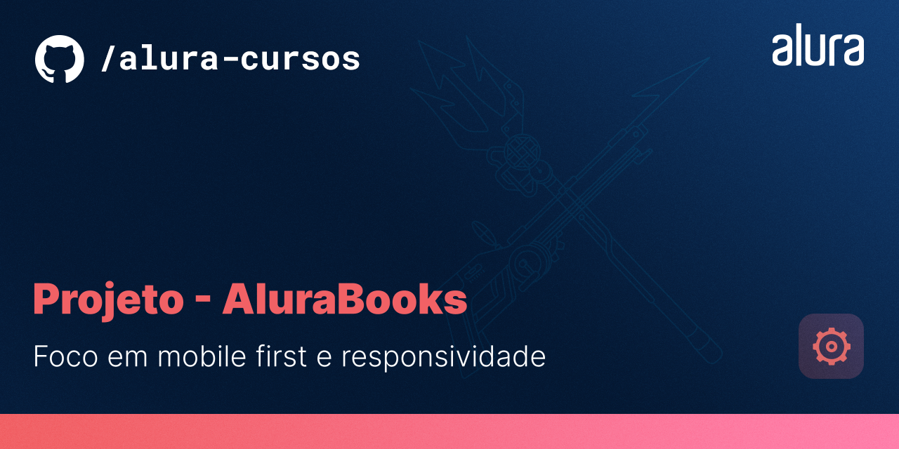

# Projeto-alura-books

# Resumo do projeto

Projeto da Home de uma loja de livros fictícia, a AluraBooks, com foco em se práticar HTML, CSS e Responsividade. Adotando a abordagem mobile-first foram pensados três cenários 424px, 1024px e 1728px. Utilizei também o [SwiperJS](https://swiperjs.com/) para o carrossel. Para as próximas etapas penso em desenvolver o restante das páginas do site e adicionar alguns estilos diferentes.

# ✔️ Técnicas e tecnologias utilizadas

- 
- 

# 📁 Acesso ao projeto

Você pode acessar os arquivos do projeto clicando [aqui](https://github.com/mvergara94/projeto-alura-books/find/main). E o link através do Github pages é [este](https://mvergara94.github.io/projeto-alura-books/).

# Screenshots da tela inicial

 ##  📱 Layout Mobile
 

 

##  📘 Layout Tablet

 

## 🖥️ Layout Desktop

 

# ✉️ Redes Sociais

 

 
  
  
   

  
 

